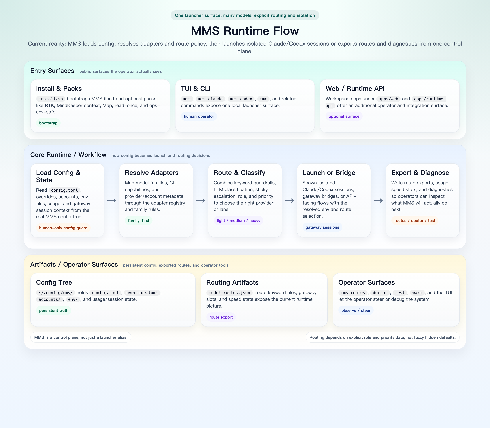

# Multi-Model Switch (MMS)

[简体中文 README](./README.zh-CN.md)

[](https://opensource.org/licenses/MIT)

> A local launcher that unifies `claude`, `codex`, and other AI coding CLIs behind one entrypoint.


## Why MMS

**MMS** helps local developers manage multiple AI coding tools from one place:

- One TUI to browse model families and launch sessions
- One config system for gateway providers and OAuth accounts
- One way to export env vars or presets for scripts and automation
- One routing layer for provider priority, bridge compatibility, and diagnostics

<!-- repo-graphics:runtime-start -->
## Runtime Flow



This diagram compresses the current MMS mainline into one picture: config and routing first, then isolated launch, export, and diagnostics.
<!-- repo-graphics:runtime-end -->

## Install

### Quick install

```bash
curl -fsSL https://raw.githubusercontent.com/CtriXin/multi-model-switch/main/install.sh | bash -s --
```

By default, the installer pulls the latest semver tag.
When run in an interactive terminal, it asks for UI language first, then the optional `RTK enhancement`, `MindKeeper context pack`, `Map auto-index`, `read-once`, and `ops-env-safe`, and finally checks whether `Claude Code` / `Codex CLI` are already present before asking to install any missing ones.

Public surface note:

- Installing `claude` here means installing the local `Claude Code` binary as a frontend CLI via `npm install -g @anthropic-ai/claude-code`.
- The public build keeps the `claude` tab and `mms claude`.
- It can show both native `claude-*` models and bridge-capable GPT / Gemini / compatible domestic models when the current routes support them.
- Public docs do not include `Claude OAuth account.add/login`.

### Install policy

- Use `main/install.sh` for normal installs and upgrades after a fix has landed on `main`.
- Use a `tag-pinned installer` for an urgent hotfix that has been released but not merged to `main` yet:

```bash
curl -fsSL https://raw.githubusercontent.com/CtriXin/multi-model-switch/v1.16.3/install.sh | bash
```

- Reason: installer fixes live in `install.sh` itself; a stale `main/install.sh` can still miss a hotfix even if the tag already exists.

### Verify right after install

```bash
bash install.sh --check
mms doctor
mms test --provider <id> --cli claude
mms test --provider <id> --cli codex
```

Meaning:

- `--check`: verify install landing paths
- `doctor`: verify route / auth / protocol reachability
- `test`: verify the real message path for one provider / CLI pair

### Clean up a previously dirty install

If you installed from an older broken installer that may have written into a gateway session home, run the cleanup script first in `dry-run` mode:

```bash
curl -fsSL https://raw.githubusercontent.com/CtriXin/multi-model-switch/main/scripts/cleanup_dirty_install.sh | bash
```

Then apply it only if the reported paths look correct:

```bash
curl -fsSL https://raw.githubusercontent.com/CtriXin/multi-model-switch/main/scripts/cleanup_dirty_install.sh | bash -s -- --apply
```

The script only targets obvious leaked artifacts from dirty installs:

- `<session-home>/.mms`
- `<session-home>/.nvm`
- `<session-home>/.config/mms`
- `<session-home>/.local/bin/mms`
- `<session-home>/.local/bin/ccs`
- `~/.local/bin/mms` / `~/.local/bin/ccs` when they still point into a gateway session path

If you need a hotfix-specific cleanup script before `main` is updated, replace `main` with the released tag, for example `v1.16.3`.

### Full reset before reinstall

If a machine has too much historical MMS state and you want to reinstall from scratch, use the full reset script in `dry-run` mode first:

```bash
curl -fsSL https://raw.githubusercontent.com/CtriXin/multi-model-switch/main/scripts/reset_mms_install.sh | bash
```

Apply it only after confirming the reported paths are correct:

```bash
curl -fsSL https://raw.githubusercontent.com/CtriXin/multi-model-switch/main/scripts/reset_mms_install.sh | bash -s -- --apply
```

By default it only removes MMS-owned surfaces:

- `~/.mms`
- `~/.config/mms`
- `~/.local/bin/mms`
- `~/.local/bin/ccs`
- `~/.local/bin/mmslogs`

It intentionally does not touch shared `~/.claude`, shared `~/.codex`, or any global OAuth state.

If you previously used `install.sh --write-shell-rc` and also want to remove the exact `# Added by MMS` PATH block from your shell rc, add:

```bash
curl -fsSL https://raw.githubusercontent.com/CtriXin/multi-model-switch/main/scripts/reset_mms_install.sh | bash -s -- --apply --include-shell-rc
```

### Default English UI on install

```bash
curl -fsSL https://raw.githubusercontent.com/CtriXin/multi-model-switch/main/install.sh | bash -s -- --lang en
```

### Install with optional RTK rewrite enhancement

```bash
curl -fsSL https://raw.githubusercontent.com/CtriXin/multi-model-switch/main/install.sh | bash -s -- --install-rtk
```

This optional path installs `jq` + `rtk`, wires the Claude `PreToolUse:Bash` hook, and when `Codex CLI` is already available (or gets installed in the same run) it also runs `rtk init --codex --global`.

### Install with optional MindKeeper context pack

```bash
curl -fsSL https://raw.githubusercontent.com/CtriXin/multi-model-switch/main/install.sh | bash -s -- --install-mindkeeper-context
```

This optional path installs `MindKeeper MCP`, Claude `/distill`, Claude `/cz`, and the Claude `UserPromptSubmit` token monitor hook. If `jq` is missing, the installer also attempts to install it because the hook depends on it.

By default, MMS pins this pack to the tested `MindKeeper v2.2.0`.
Override it when needed:

```bash
curl -fsSL https://raw.githubusercontent.com/CtriXin/multi-model-switch/main/install.sh | bash -s -- --install-mindkeeper-context --mindkeeper-ref v2.2.0
curl -fsSL https://raw.githubusercontent.com/CtriXin/multi-model-switch/main/install.sh | bash -s -- --install-mindkeeper-context --mindkeeper-ref main
```

Scope notes:

- This pack is `Claude`-first; it does not add Hive compact/restore features
- It does not auto-create a separate `Codex` slash command surface
- `Hive`-related hooks and packs remain outside the default MMS install path

### Install with optional Map auto-index

```bash
curl -fsSL https://raw.githubusercontent.com/CtriXin/multi-model-switch/main/install.sh | bash -s -- --install-map
```

This optional path installs `Map` and wires the Claude `SessionStart` auto-index hook so project structure indexing can be built or refreshed automatically when a session starts. By default, MMS pins `Map` to the tested release `v0.3.1`.

Override the bundled `Map` version when needed:

```bash
curl -fsSL https://raw.githubusercontent.com/CtriXin/multi-model-switch/main/install.sh | bash -s -- --install-map --map-ref main
curl -fsSL https://raw.githubusercontent.com/CtriXin/multi-model-switch/main/install.sh | bash -s -- --install-map --map-ref v0.3.1
```

Scope notes:

- The current integration targets the Claude `SessionStart` hook first
- It prefers an existing local `Node.js 18+` runtime; if none is available, MMS skips `Map` instead of changing your default `Node` automatically
- Use `--ensure-node22` only when you explicitly want MMS to prepare a separate `Node 22` fallback
- If the `Map` build output is missing, the installer skips hook injection and prints a warning

### Install with optional read-once

```bash
curl -fsSL https://raw.githubusercontent.com/CtriXin/multi-model-switch/main/install.sh | bash -s -- --install-read-once
```

This optional path installs `read-once` and wires two Claude hooks:

- `PreToolUse:Read` token saver hook
- `PostCompact` cache reset hook

It avoids redundant full-file rereads and prefers diffs after file changes. If `jq` is missing, the installer attempts to install it; if it is still unavailable, the hooks stay fail-open and do not block Claude.

### Install with optional ops-env-safe

```bash
curl -fsSL https://raw.githubusercontent.com/CtriXin/multi-model-switch/main/install.sh | bash -s -- --install-ops-env-safe
```

This optional path installs a path-only host integration pack for isolated sessions:

- a Codex skill: `~/.codex/skills/ops-env-safe`
- a Claude command: `~/.claude/commands/ops-env-safe.md`
- a local path-map template: `~/.config/mms/ops-env-safe.toml`

Scope notes:

- It is `path-only`; it does not inject real `HOME/XDG`
- It does not export auth secrets or bootstrap a host shell
- Edit `~/.config/mms/ops-env-safe.toml` to add your own stable host paths after install
- Use this when isolated `mms/mmc` sessions need to know where configs, caches, or shared bins live without breaking isolation

After install:

- in Claude, use `/ops-env-safe <entry-name>`
- in Codex, let the `ops-env-safe` skill trigger on path lookup requests

### Install MMS plus selected CLIs

```bash
curl -fsSL https://raw.githubusercontent.com/CtriXin/multi-model-switch/main/install.sh | bash -s -- --install-cli claude,codex
```

Supported names: `claude`, `codex`.

### Upgrade

```bash
curl -fsSL https://raw.githubusercontent.com/CtriXin/multi-model-switch/main/install.sh | bash -s --
```

### Install a specific version or branch

```bash
curl -fsSL https://raw.githubusercontent.com/CtriXin/multi-model-switch/main/install.sh | bash -s -- --ref v1.3.5
curl -fsSL https://raw.githubusercontent.com/CtriXin/multi-model-switch/main/install.sh | bash -s -- --main
```

## Language

MMS defaults to Chinese unless you choose English during install or override it explicitly.

Supported ways to switch UI language:

```bash
mms config set ui.language en
mms config set ui.language zh

MMS_LANG=en mms
mms --lang en
```

Priority order:

1. `--lang`
2. `MMS_LANG`
3. `ui.language` in config
4. install preference
5. fallback `zh`

## Quick start

### First-time setup

```bash
mms config connect
```

### Launch the TUI

```bash
mms
```

### Non-interactive examples

```bash
mms --preset coding
mms claude --provider openrouter
mms codex --account work
mms --trace --preset coding
```

## Core features

- Unified TUI for model-family-first navigation
- Gateway providers and supported OAuth accounts in one config surface
- Provider/account priority with bridge-aware routing
- Presets and load-balance profiles
- Usage tracking, route export, and diagnostics
- Per-account isolation for supported OAuth login state
- `doctor`, `test`, `warm`, `routes`, and `session` utilities

## Screenshots

### Claude tab


### Codex tab


### Launch confirm


## Supported CLIs

| CLI | Primary protocol | Notes |
|-----|------------------|------|
| `claude` | Anthropic Messages | Public build keeps the tab and `mms claude`; it can expose both native `claude-*` models and bridge-capable non-Claude models when routes support them |
| `codex` | OpenAI Responses | Falls back to chat-completions bridge when needed |
| `qwen` | OpenAI compatible | Direct launch |
| `kimi` | OpenAI compatible | Defaults to `kimi-k2.5` |
| `gemini` | Google AI | OAuth account support |

## Common commands

```bash
mms config connect
mms config provider.list

mms ls
mms warm
mms routes
mms routes export

mms doctor                      # default lite: route / auth / protocol only
mms doctor full                 # full: also runs real Claude CLI smoke
mms test --provider <id> --cli <name>  # minimal end-to-end message path smoke

mms chat "explain recursion"
mms discuss "design a protocol"
```

## Config layout

```text
~/.config/mms/
├── config.toml
├── credentials.sh
├── usage.json
├── model-routes.json
├── model-routes.snapshots/
├── env/
└── accounts/
```

## Hive routes export

- Fixed latest path: `~/.config/mms/model-routes.json`
- Snapshot history: `~/.config/mms/model-routes.snapshots/`
- Export shape is minimal: `version`, `generated_at`, and per-model `primary` / `fallbacks`
- Each route entry only includes `provider_id`, `anthropic_base_url`, `openai_base_url`, and `api_key`
- Snapshot dedupe uses a canonical content hash over `version + routes`; `generated_at` is excluded from the hash
- If the canonical content is unchanged, MMS reuses the existing snapshot and mirrors that snapshot back to `model-routes.json` instead of creating a new snapshot
- Starting the `mms` CLI now forces a synchronous Hive routes refresh before command dispatch so in-session Hive reads the latest usable routes sooner

Key docs:

- [Routing system](./docs/MMS_ROUTING_SYSTEM.md)
- [CLI/provider compatibility QA](./docs/CLI_PROVIDER_COMPAT_QA.md)
- [Agent guardrails](./docs/AGENT_GUARDRAILS.md)

## What the `claude` tab shows in the public build

- The `claude` tab is still visible.
- It can list native `claude-*` models when the current routes expose them.
- It can also list bridge-capable non-Claude models, such as GPT / Gemini / compatible domestic families, when a route supports `claude` bridge mode.
- Public docs and commands do not include `Claude OAuth account.add/login`.

## Notes

- `priority` is runtime-level, not per-model
- Higher numeric `priority` means higher precedence
- `role` still outranks `priority`: `primary > auto > fallback`
- `use_count` still affects MMS display/ranking metadata, but it is no longer exported to Hive
- Hive reads the ordered `primary` + `fallbacks` contract and does not need MMS internal priority / ranking fields

## License

MIT
