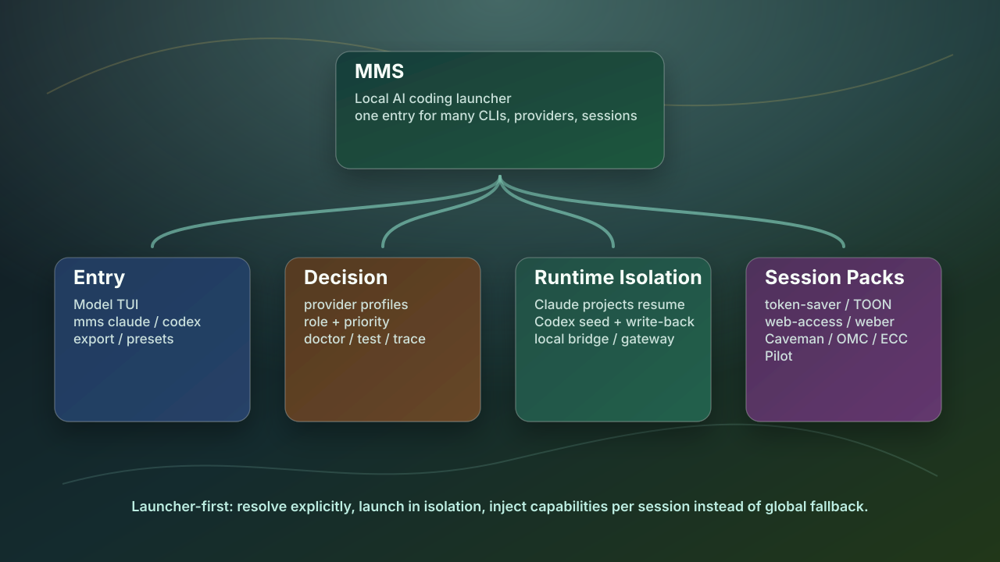

# Multi-Model Switch (MMS)

[简体中文 README](./README.zh-CN.md)

[](https://opensource.org/licenses/Apache-2.0)

> A launcher-first runtime manager for local AI coding CLIs. Use one entrypoint to choose models, providers, session packs, and isolated Claude/Codex homes without turning your real global account state into a fallback pool.



## What MMS Does

MMS is not another chat client. It is the local control plane in front of tools such as `claude`, `codex`, `opencode`, and `agy`; Qwen/Kimi/Gemini remain provider models, not standalone CLI launchers.

Scope note: MMS is intentionally launcher-first. Legacy or helper surfaces such as `chat`, `discuss`, and high-context review helpers are maintenance-only unless they directly support launcher/session validation. Long-running planning, execution, compaction policy, and run authority should live in Moebius, Pilot, Ant, or addons instead of expanding MMS.

It helps you:

- start the right CLI from one TUI or command line
- choose providers and OAuth/account profiles explicitly
- keep Claude/Codex session state isolated and resumable
- bridge compatible model providers while preserving protocol semantics
- inject session-scoped skills and hooks without editing global config
- diagnose provider, route, cache, and exposed runtime state before blaming a model

## Current Version

Current stable release: `v3.3.1`

Feature branch: `main` (tracks the newest iteration before the next stable cut)

Key changes in this generation:

- Codex primary/rescue fallback now retries prompt-cache-sensitive GLM/DeepSeek/Qwen-compatible routes over Anthropic `/v1/messages` when a gateway rejects `/v1/chat/completions`
- provider profiles for OpenAI, Qwen/DashScope, MiMo, MiniMax, DeepSeek, Kimi Code, and GLM/Z.ai
- profile-driven auth/body/thinking/effort patching across bridge and dispatch paths
- Claude resume persistence through `.claude/projects`
- Claude-on-MMS vision sidecar: text-only domestic models fail closed or delegate screenshots/images to a configured Kimi/MiMo/Qwen-compatible sidecar instead of stalling
- Codex resume write-back across isolated MMS-managed launches
- OpenCode modes: `Agent`, `OMO`, and `Raw` with repo-local health feedback
- OpenCode Agent contract lane: `mobius-spec-writer` writes an OpenSpec/SpecBridge-style task contract, and `mobius-spec-compliance-reviewer` checks diff + validation against it before release-gate review
- OpenCode Agent work split: GPT handles coordination, specs, implementation/fix work, and final review; DeepSeek/MiMo/Qwen/GLM/Kimi default to lightweight read-only exploration, bug-hunt, vision, and context checks
- OpenCode Agent mixed routes: GPT via OpenAI-compatible Responses/Chat, direct MiMo via OpenAI-compatible `/v1`, other domestic models via Anthropic `/v1/messages`
- OpenCode bypass is enabled by default through permission `allow`; subagent `ask` permissions are auto-approved while explicit `deny` boundaries stay intact, and optional `opencode run` preflight uses `--dangerously-skip-permissions`
- model fallback order: same-model second channel, same-role peer, then stable GPT fallback
- runtime discovery across PATH, Homebrew, and all NVM Node versions without changing default Node
- real-home compatibility wrappers for Keychain/Chrome/global CLIs inside isolated sessions
- installer-managed Python virtualenv plus MMS-managed Python fallback when system Python is missing or too old
- bundled lightweight session assets for `Caveman`, `token-saver`, `TOON`, `xmem`, and the Web automation bundle (`weber` router + `web-access` logged-in Chrome + `agent-browser` headless); Claude/Codex/OpenCode/Antigravity injection stays session-local
- Caveman now defaults to `lite`, keeping full sentences while still removing filler; `/caveman full` remains available for stronger compression
- quiet hook policy: MMS-managed Claude/Codex sessions avoid default SessionStart/UserPrompt probes; remaining hooks are guard, closeout, or explicitly enabled pack hooks
- session MCP hardening resolves inherited Claude MCP commands to real-HOME absolute CLIs or drops missing ones, and also surfaces URL-based MCP servers from installed Claude plugins (for example Figma); for Codex, app-backed integrations already enabled in real `~/.codex/config.toml` win over duplicate inherited URL MCP entries so MMS does not create a second broken OAuth path; Codex Caveman preserves trusted hook order where possible
- optional BrainKeeper context pack installs MCP, Claude commands/hooks, and `bk` / `brainkeeper` wrappers without requiring Xcode/git
- optional xmem installer pack: `--install-xmem` installs the generic xmem CLI/skill, `--xmem-ref` can pin the source ref, and `--dry-run` previews the install/setup plan without writing files
- optional MMS-managed ECC/OMC Claude agent-pack installer flow

MMS also bundles the generic `xmem` skill plus a quiet session closeout hook. It no longer adds default `xmem` SessionStart sync or UserPrompt gateway probes; agents can call the `xmem` skill/CLI explicitly when a task needs recall. The closeout hook only runs when an `xmem` CLI is configured; if the CLI is absent it fails open. Durable summaries stay in the user's configured xmem sources, not in MMS itself. Public xmem onboarding stays low-touch: the optional installer creates `~/.xmem`, registers shallow HOME git roots, and does not write repo-local `.xmem` files until a user or agent runs `xmem setup` inside a project.

## Install Or Upgrade

Recommended stable install (tracks the newest published stable release):

```bash
curl -fsSL https://raw.githubusercontent.com/CtriXin/multi-model-switch/main/install.sh | bash -s -- --latest-release
```

New feature install (tracks `main` before the next stable cut):

```bash
curl -fsSL https://raw.githubusercontent.com/CtriXin/multi-model-switch/main/install.sh | bash -s -- --main
```

Current stable exact pin (`v3.3.1`):

```bash
curl -fsSL https://raw.githubusercontent.com/CtriXin/multi-model-switch/v3.3.1/install.sh | bash -s --
```

Channel behavior:

- `--latest-release` follows the newest human-stabilized GitHub Release
- `--main` follows the newest feature iteration on the default branch
- no flag still installs the latest semver tag, which may be newer than the curated stable release line

Default behavior after ref/channel selection:

- installs the requested ref into an isolated MMS runtime under `~/.mms`
- links `mms` and `mmslogs` into `~/.local/bin`
- creates `~/.mms/.venv` and uses Python 3.11+ without replacing the user's system Python
- if Python 3.11+ is missing, prepares an MMS-managed Python via `uv` under `~/.mms`
- discovers installed `claude` / `codex` / `opencode` / `agy` across PATH, Homebrew, and NVM versions
- retires the legacy `ccs` and `mmc` shims; new installs expose `mms` / `mmslogs`, not `ccs` / `mmc`
- asks before installing optional packs or missing frontend CLIs
- does not silently rewrite your real provider/account configuration

Fresh-machine install with optional CLI bootstrap:

```bash
curl -fsSL https://raw.githubusercontent.com/CtriXin/multi-model-switch/main/install.sh | bash -s -- --install-cli claude,codex,opencode --write-shell-rc
```

Shell support:

- Bash/Zsh: `--write-shell-rc` writes `~/.local/bin` into the active shell rc.
- Fish: `--write-shell-rc` writes `~/.config/fish/conf.d/mms.fish`.
- Ghostty/iTerm/Terminal: reopen the tab after install, or run `exec $SHELL -l`.
- If you do not write shell rc, run `~/.local/bin/mms` immediately; direct `mms` works after PATH is loaded.

Set the UI language during install:

```bash
curl -fsSL https://raw.githubusercontent.com/CtriXin/multi-model-switch/main/install.sh | bash -s -- --lang en
curl -fsSL https://raw.githubusercontent.com/CtriXin/multi-model-switch/main/install.sh | bash -s -- --lang zh
```

Pin a release when you need an exact version:

```bash
curl -fsSL https://raw.githubusercontent.com/CtriXin/multi-model-switch/v3.3.1/install.sh | bash -s --
```

Verify the install:

```bash
bash install.sh --check
mms doctor
mms test --provider <id> --cli claude
mms test --provider <id> --cli codex
```

Model families are provider models, not direct `qwen`/`kimi` CLI installs. On a
fresh machine, MMS shows configured `fallback_models` / `extra_models`
immediately while refreshing `/models` in the background; if a family is still
missing on the same key, compare provider config/credentials and run
`mms models` or `mms doctor full`.

Stable legacy route export is conservative: a refreshed provider `/models`
response may add routes, but it does not drop previously approved local routes
for the same enabled provider unless the provider is disabled/removed, the
model is hidden, or WebUI sends an explicit stale-route cleanup scope.

## Quick Start

Interactive launch:

```bash
mms
```

Direct CLI launch:

```bash
mms claude
mms codex
mms opencode
mms opencode --profile agent
mms opencode --profile omo
mms opencode --profile raw
mms --provider <provider-id> codex
mms --provider <provider-id> opencode
mms --account <account-id> claude
```

Export environment variables instead of launching:

```bash
mms --export codex
mms --export opencode
mms --export claude --apply
```

Inspect routes and health:

```bash
mms models
mms routes
mms doctor
mms test --provider <id> --cli claude
mms exposure
mms logs
```

## Mental Model

```text
MMS
├── Entry
│   ├── mms TUI
│   ├── mms claude / mms codex / mms opencode / mms agy
│   └── export / presets
├── Decision
│   ├── provider profiles
│   ├── role + priority routing
│   └── doctor / test / trace diagnostics
├── Runtime Isolation
│   ├── Claude: session HOME + .claude/projects resume
│   ├── Codex: bounded .codex seed + write-back
│   ├── OpenCode: real HOME + session-local XDG/config
│   └── bridge: local protocol adapters when needed
└── Session Packs
    ├── token-saver / TOON
    ├── Web automation bundle
    └── Caveman / OMC / ECC / Pilot
```

The diagram source lives in:

- `docs/images/mms-launcher-tree.mmd`
- `docs/images/mms-launcher-tree-outline.md`
- `docs/images/mms-launcher-tree.html`

## Runtime Safety Rules

MMS tries to fail closed inside the selected runtime.

- Real `HOME` and global OAuth state are protected surfaces, not fallback pools.
- A failed provider/account should not silently become another global account.
- Claude semantics prefer `Anthropic /v1/messages` when a route supports it.
- `OpenAI /v1/chat/completions` is fallback transport, not an invisible equivalent.
- GUI/Keychain/browser launches from isolated sessions go through real-home wrappers; OpenCode keeps config/state session-local with real `HOME`.
- Background helpers do not read macOS Keychain unless `MMS_STATUSLINE_KEYCHAIN_USAGE=1`, `MMS_ALLOW_KEYCHAIN_READ=1`, or `mms usage --keychain` is explicitly used.
- Session packs are injected into the isolated session; they are not global default hooks.
- Resume data is bounded and scoped so startup stays usable and account state stays isolated.

Operational details:

- [Provider profiles](./docs/PROVIDER_PROFILES.md)
- [User preferences](./docs/MMS_USER_PREFERENCES.md)
- [Claude cache / protocol runbook](./docs/SERVER_CLAUDE_CACHE_RUNBOOK.md)
- [Agent guardrails](./docs/AGENT_GUARDRAILS.md)
- [CLI/provider compatibility QA](./docs/CLI_PROVIDER_COMPAT_QA.md)

## Provider Profiles

Provider-specific behavior belongs in data, not in one-off launcher branches.

`config/provider-profiles.json` records:

- OpenAI-compatible and Anthropic-compatible endpoints
- auth header expectations
- Thinking / Effort request fields
- provider-specific body patches
- provider-specific parameter aliases
- context window metadata
- reference URLs for future verification

User overlays can live in the MMS config directory as read-only profile inputs. MMS should not mutate your real `config.toml` just because a model was probed.

## User Preferences

Use `~/.config/mms/preferences.toml` for install-safe daily launch preferences:

- `thinking_mode` / `reasoning_effort`
- `bypass`, `caveman_mode`, `nsr_mode`, `agent_pack`
- disabled session `skills` / `mcp` / `hooks`
- custom bundled asset roots such as `web_access`, `token_saver`, `xmem`, `nsr`, `ecc`, `omc`

LLMs can discover the safe schema with `mms config preferences.help` or `mms config preferences.example`. This file is still real MMS config: agents may inspect and propose edits, but must not auto-write `~/.config/mms/**` without human confirmation.

## Session Packs

MMS can expose capabilities per session without writing global hooks/config.

| Pack | Install state | Purpose |
| --- | --- | --- |
| `token-saver` / `TOON` | bundled in `~/.mms/vendor` | compact long outputs and structured handoffs |
| `xmem` | bundled in `~/.mms/vendor` | generic cross-project memory / truth-index skill; only active when an `xmem` CLI/source is configured |
| Web automation bundle | bundled in `~/.mms/vendor` | `weber` routes the task, `web-access` connects logged-in Chrome, and `agent-browser` handles lightweight headless flows |
| `Caveman` | bundled in `~/.mms/vendor` | compact communication mode; only active when enabled by preference or launch confirmation |
| `NSR` | built-in hooks, default on | session-local continuation hooks for active NSR goals; no default startup or prompt hook |
| `ECC` | optional MMS-managed pack | Claude engineering workflow / rules / quality hooks |
| `OMC` | optional MMS-managed pack | Claude orchestration runtime / team / verify loop |
| `Pilot` / `auto-github-contributor` | detected when installed | planning and contribution surfaces |

These surfaces are previewed before launch and can be disabled per session when supported by the confirmation UI. Passive skills (`token-saver`, `TOON`, `xmem`, `web-access`, `weber`, `agent-browser`) are available naturally in MMS-launched sessions. `NSR` is enabled by default for MMS-managed Claude/Codex sessions, but its default hook surface is limited to tool/compact/closeout events and can be disabled from the launch confirmation screen or with `nsr_mode = "disable"` in `preferences.toml`. Heavier active behavior packs (`ECC`, `OMC`) still require explicit selection. OpenCode receives session-local Caveman / token-saver / TOON / xmem / web-access / weber skills, and RTK is added through the session-local plugin directory when `rtk` exists.

## Optional Installer Packs

Install global optional packs only when you want them available outside MMS-managed sessions:

```bash
bash install.sh --install-rtk
bash install.sh --install-brainkeeper-context
bash install.sh --install-map
bash install.sh --install-codegraph
bash install.sh --install-read-once
bash install.sh --install-token-saver
bash install.sh --install-toon
bash install.sh --install-xmem
bash install.sh --install-ops-env-safe
```

Add `--dry-run` to preview the install plan without writing files, for example `bash install.sh --install-xmem --dry-run`.

`--install-brainkeeper-context` installs/updates the full BrainKeeper context pack: BrainKeeper MCP, Claude `/distill` / `/cz` / `/cr`, token hooks, and `~/.local/bin/bk` plus `~/.local/bin/brainkeeper`. The installed runtime lives at `~/.local/share/brainkeeper`; when a sibling BrainKeeper repo exists, the installer reuses its `install.sh`, but the active install still syncs into that directory. If Node/npm is missing, the installer prepares an nvm Node 22 runtime for this install without changing the user's default Node. If Xcode/git is unavailable, it falls back to a GitHub archive download.

`--install-map` installs the project-structure Map and enables the Claude SessionStart auto-index hook. It helps Claude orient in a repo faster by refreshing a lightweight directory/file map. This is a global Claude hook; use `--map-ref` to pin the version.

`--install-codegraph` installs the CodeGraph CLI/MCP via npm for symbol search, callers/callees, and code-context retrieval. MMS no longer adds a default SessionStart auto-register hook for CodeGraph; run indexing explicitly when a repo needs it. Use `--codegraph-package` to override the npm package spec. To initialize everything immediately, ask an LLM: “Find every git repo under this workspace, run `codegraph init -i` when `.codegraph` is missing and `codegraph sync` when it exists, skip `node_modules/vendor/build`, and report failures.”

`--install-read-once` installs Claude Read token-saving hooks. Within one session it warns on repeated reads of unchanged files and prefers diffs after edits. It works automatically; users do not need to remember a command.

`--install-token-saver` installs the shared Codex/Claude token-saver skill plus local commands for long logs, test output, broad `rg`, `git diff/show`, and noisy diagnostics as refs plus snippets. Agents use the low-level commands automatically; users can just say `/token-saver` or ask to save context.

`--install-toon` installs the shared Codex/Claude TOON skill plus the local `mms-toon` command for structured JSON/status/handoff compression in export-only sessions outside MMS. MMS-launched sessions still bundle TOON by default. Do not use TOON for prose, code, raw logs, secrets, or exact CLI/API JSON.

`--install-xmem` installs the generic xmem CLI plus the shared Codex/Claude xmem skill for export-only sessions outside MMS, then runs a lightweight `xmem setup`: it creates `~/.xmem` and registers shallow git roots under HOME without writing repo-local `.xmem` files. Use `--xmem-ref` to pin a tag or branch. MMS-launched sessions still bundle the xmem session asset by default.

`--install-ops-env-safe` is an advanced-only path hint pack: it writes a Codex skill, Claude `/ops-env-safe`, and `~/.config/mms/ops-env-safe.toml` so export-only or special isolated sessions can inspect known host paths. Normal MMS sessions already receive real-HOME path hints and session host context, so most users do not need it. It does not set real `HOME`/`XDG_*` and does not export auth secrets.

Legacy `--install-mindkeeper-context` and `--mindkeeper-ref` still work as deprecated aliases for BrainKeeper installs.

Install MMS-managed Claude agent packs without touching global Claude config:

```bash
bash install.sh --install-ecc
bash install.sh --install-omc
bash install.sh --install-agent-packs
```

Most day-to-day MMS sessions do not need global hook installation; the launcher can inject bundled or MMS-managed session assets directly.

## Cleanup And Reset

Dry-run dirty-install cleanup:

```bash
curl -fsSL https://raw.githubusercontent.com/CtriXin/multi-model-switch/main/scripts/cleanup_dirty_install.sh | bash
```

Apply only after checking the printed paths:

```bash
curl -fsSL https://raw.githubusercontent.com/CtriXin/multi-model-switch/main/scripts/cleanup_dirty_install.sh | bash -s -- --apply
```

Full MMS-owned reset, dry-run first:

```bash
curl -fsSL https://raw.githubusercontent.com/CtriXin/multi-model-switch/main/scripts/reset_mms_install.sh | bash
```

Then apply:

```bash
curl -fsSL https://raw.githubusercontent.com/CtriXin/multi-model-switch/main/scripts/reset_mms_install.sh | bash -s -- --apply
```

Reset targets MMS-owned install/config surfaces. It intentionally avoids shared `~/.claude`, shared `~/.codex`, and global OAuth state unless an explicit flag says otherwise.

## Developer Notes

Run focused checks before publishing launcher/session changes:

```bash
python3 -m py_compile mms_core.py mms_launchers.py mms_tui.py
PYTHONPATH=. python3 -m pytest -q tests/test_codex_history_growth.py
PYTHONPATH=. python3 -m pytest -q tests/test_claude_hardening_regressions.py -k 'resume or routing or bridge'
git diff --check
```

Release checklist:

1. keep the working tree clean
2. choose the next semver tag
3. create an annotated tag
4. push branch and tag
5. create a GitHub Release with install/upgrade notes

## License

Apache-2.0
