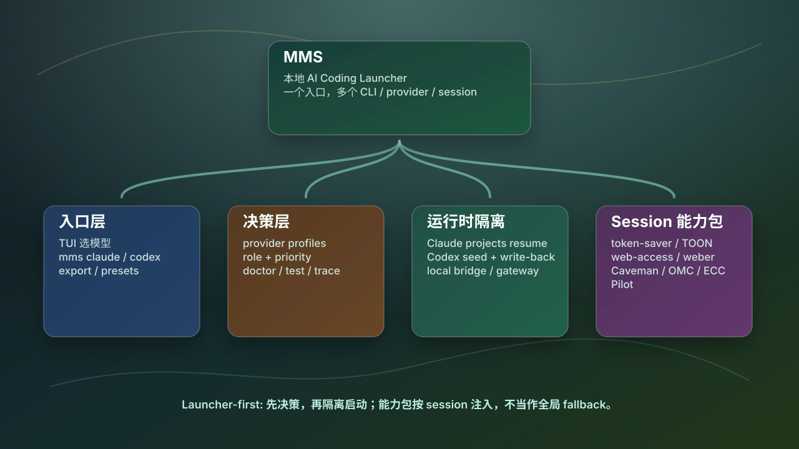

# Multi-Model Switch (MMS)

[English README](./README.md)

[](https://opensource.org/licenses/Apache-2.0)

> 一个 launcher-first 的本地 AI Coding CLI 运行时管理器：用一个入口选择模型、provider、session 能力包和隔离的 Claude/Codex HOME，同时避免把真实全局账号状态当成 fallback 池。



## MMS 是什么

MMS 不是新的 chat 客户端。它是 `claude`、`codex`、`opencode`、`agy` 等本地 AI coding CLI 前面的控制面；Qwen/Kimi/Gemini 保留为 provider model，不再作为独立 CLI 启动。

MMS 的主线是 launcher-first。`chat`、`discuss` 和高上下文 review helper 属于 legacy / maintenance-only 表面，除非直接支持 launcher/session 验证，否则不继续扩展；长期规划、执行、压缩策略和 run authority 应放在 Moebius、Pilot、Ant 或 addons。

它解决这些问题：

- 用一个 TUI 或命令启动不同 CLI
- 显式选择 provider、OAuth/account profile 和模型
- 让 Claude/Codex 的 session 隔离且可 resume
- 在兼容模型源上做 bridge，同时保留协议语义
- 按 session 注入 skills/hooks，而不是污染全局配置
- 在怀疑模型前，先诊断 provider、route、cache 和实际暴露的 runtime state

## 当前版本

当前 tagged version：`v2.11.1`

这一代的重点：

- provider profiles 覆盖 OpenAI、Qwen/DashScope、MiMo、MiniMax、DeepSeek、Kimi Code、GLM/Z.ai
- bridge / launcher / chat / discuss / router 共享 profile-driven auth/body/thinking/effort patch
- Claude 通过 `.claude/projects` 恢复项目级 resume
- mmd 启动 Claude 时恢复 vision sidecar：text-only 国产模型遇到截图/图片会 fail closed，或委托已配置的 Kimi/MiMo/Qwen-compatible sidecar 先读图，避免卡死
- Codex 在隔离的 MMS-managed launch 之间做 bounded resume write-back
- OpenCode profiles：`Orchestrated`、`Roster`、`Raw`，并写入 repo-local health feedback
- OpenCode Lite Pro mixed routes：GPT 走 OpenAI-compatible Responses/Chat，direct MiMo 走 OpenAI-compatible `/v1`，其他国产模型走 Anthropic `/v1/messages`
- OpenCode 默认开启 bypass：通过 permission `allow` 生效，subagent 里的 `ask` 会自动放行但保留显式 `deny` 边界；可选的 `opencode run` preflight 会使用 `--dangerously-skip-permissions`
- fallback 顺序：同模型第二通道、同 role peer、stable GPT fallback
- runtime discovery 跨 PATH、Homebrew、所有 NVM Node 版本，不改默认 Node
- 隔离 session 内置 real-home wrappers，修复 Keychain/Chrome/global CLI 的 HOME/XDG 兼容
- installer 自动创建 Python virtualenv；系统 Python 缺失或过旧时，用 MMS-managed Python 兜底
- 内建 lightweight session assets：`Caveman`、`token-saver`、`TOON`、`web-access`、`weber`、`agent-browser`；Claude/Codex/OpenCode/Antigravity 都保持 session-local 注入
- silent hook policy：Caveman / Map / RTK 避免 noisy hook stdout；Claude/Codex hook 只输出合法 compact JSON
- session MCP hardening：继承 Claude MCP 时解析 real HOME 中的 CLI 绝对路径，找不到就不注入；Codex Caveman 尽量保留已信任 hook 顺序
- 可选 BrainKeeper context pack 会安装 MCP、Claude 命令/hooks、`bk` / `brainkeeper` 命令，且没有 Xcode/git 时走 archive fallback
- ECC/OMC Claude agent pack 变成 MMS-managed 可选安装包，启动确认页互斥选择

## 安装 / 升级

```bash
curl -fsSL https://raw.githubusercontent.com/CtriXin/multi-model-switch/main/install.sh | bash -s --
```

默认行为：

- 安装最新 semver tag
- 在 `~/.mms` 创建隔离 MMS runtime
- 把 `mms` 链接到 `~/.local/bin`
- 创建 `~/.mms/.venv`，使用 Python 3.11+，不替换用户系统 Python
- 如果没有 Python 3.11+，会通过 `uv` 在 `~/.mms` 下准备 MMS-managed Python
- 跨 PATH、Homebrew、NVM 版本发现已安装的 `claude` / `codex` / `opencode` / `agy`
- legacy `ccs` shim 仍可通过 `--install-legacy-ccs` 显式安装，但默认不再暴露
- 安装可选包或缺失 CLI 前会询问
- 不会静默改写真实 provider/account 配置

全新电脑可直接带 CLI bootstrap 安装：

```bash
curl -fsSL https://raw.githubusercontent.com/CtriXin/multi-model-switch/main/install.sh | bash -s -- --install-cli claude,codex --write-shell-rc
```

Shell 支持：

- Bash/Zsh：`--write-shell-rc` 会把 `~/.local/bin` 写入当前 shell rc。
- Fish：`--write-shell-rc` 会写入 `~/.config/fish/conf.d/mms.fish`。
- Ghostty/iTerm/Terminal：安装后重开 tab，或执行 `exec $SHELL -l`。
- 如果不写 shell rc，马上可执行 `~/.local/bin/mms`；PATH 加载后可直接输入 `mms`。

安装时指定 UI 语言：

```bash
curl -fsSL https://raw.githubusercontent.com/CtriXin/multi-model-switch/main/install.sh | bash -s -- --lang zh
curl -fsSL https://raw.githubusercontent.com/CtriXin/multi-model-switch/main/install.sh | bash -s -- --lang en
```

需要固定版本时，直接 pin release tag：

```bash
curl -fsSL https://raw.githubusercontent.com/CtriXin/multi-model-switch/v2.11.1/install.sh | bash -s --
```

安装后自检：

```bash
bash install.sh --check
mms doctor
mms test --provider <id> --cli claude
mms test --provider <id> --cli codex
```

模型 family 来自 provider model，不依赖直装 `qwen`/`kimi` CLI。全新电脑没有
probe cache 时，MMS 会先显示已配置的 `fallback_models` / `extra_models`，
同时后台刷新 `/models`；同一个 key 仍缺 family 时，优先对比 provider
config/credentials，并跑 `mms models` 或 `mms doctor full`。

## 快速使用

进入交互式启动器：

```bash
mms
```

直接启动某个 CLI：

```bash
mms claude
mms codex
mms opencode
mms opencode --profile lite_pro
mms --provider <provider-id> codex
mms --provider <provider-id> opencode
mms --account <account-id> claude
```

只导出环境变量，不启动 CLI：

```bash
mms --export codex
mms --export opencode
mms --export claude --apply
```

看 route 和健康状态：

```bash
mms models
mms routes
mms doctor
mms test --provider <id> --cli claude
mms exposure
mms logs
```

## 心智模型

```text
MMS
├── 入口层
│   ├── mms TUI
│   ├── mms claude / mms codex / mms opencode / mms agy
│   └── export / presets
├── 决策层
│   ├── provider profiles
│   ├── role + priority routing
│   └── doctor / test / trace diagnostics
├── 运行时隔离
│   ├── Claude: session HOME + .claude/projects resume
│   ├── Codex: bounded .codex seed + write-back
│   ├── OpenCode: real HOME + session-local XDG/config
│   └── bridge: 需要时启动本地协议适配
└── Session 能力包
    ├── token-saver / TOON
    ├── web-access / weber / agent-browser
    └── Caveman / OMC / ECC / Pilot
```

图的源文件：

- `docs/images/mms-launcher-tree.mmd`
- `docs/images/mms-launcher-tree-outline.md`
- `docs/images/mms-launcher-tree.html`

## 运行时安全原则

MMS 的默认策略是：在当前选择的 runtime 内 fail closed。

- 真实 `HOME` 和全局 OAuth 状态是保护面，不是 fallback 池。
- provider/account 失败时，不应静默切到另一个全局账号。
- Claude 语义在 route 支持时优先走 `Anthropic /v1/messages`。
- `OpenAI /v1/chat/completions` 是 fallback transport，不是等价默认值。
- 隔离 session 里的 GUI/Keychain/browser 启动走 real-home wrapper；OpenCode 只把 config/state 留在 session-local XDG。
- 后台 helper 默认不读 macOS Keychain；只有显式设置 `MMS_STATUSLINE_KEYCHAIN_USAGE=1`、`MMS_ALLOW_KEYCHAIN_READ=1` 或运行 `mms usage --keychain` 才查询 Claude OAuth usage。
- session pack 注入到隔离 session，不是全局默认 hook。
- resume 数据有边界、有 scope，避免 startup 膨胀和账号串线。

进一步文档：

- [Provider profiles](./docs/PROVIDER_PROFILES.md)
- [Claude cache / protocol runbook](./docs/SERVER_CLAUDE_CACHE_RUNBOOK.md)
- [Agent guardrails](./docs/AGENT_GUARDRAILS.md)
- [CLI/provider compatibility QA](./docs/CLI_PROVIDER_COMPAT_QA.md)

## Provider Profiles

厂商差异应该沉淀成数据，而不是继续在 launcher 里堆分支。

`config/provider-profiles.json` 记录：

- OpenAI-compatible / Anthropic-compatible endpoint
- auth header 规则
- Thinking / Effort 请求字段
- provider-specific body patch
- context window metadata
- 便于后续核验的官方 reference URL

用户自己的 overlay 可以作为只读 profile 输入放在 MMS config 目录。MMS 不应该因为一次 probe 就自动改写真实 `config.toml`。

## Session 能力包

MMS 可以按 session 暴露能力，不需要写全局 hooks/config：

| Pack | 安装状态 | 用途 |
| --- | --- | --- |
| `token-saver` / `TOON` | 内建 | 压缩长输出和结构化 handoff |
| `web-access` / `weber` / `agent-browser` | 内建 | 浏览器和 web 任务路由指导 |
| `Caveman` | 内建 | 低 token 沟通模式 |
| `ECC` | MMS-managed 可选包 | Claude engineering workflow / rules / quality hooks |
| `OMC` | MMS-managed 可选包 | Claude orchestration runtime / team / verify loop |
| `Pilot` / `auto-github-contributor` | 已安装时检测 | 规划和开源贡献入口 |

启动确认页会展示这些 surface；支持时也可以按当前 session 关闭某个 MCP / skill / hook。OpenCode 现在会拿到 session-local Caveman / token-saver / TOON / web-access / weber skills；如果本机有 `rtk`，也会通过 session-local plugin 目录注入静默 RTK plugin。ECC 和 OMC 默认关闭，只有在 Claude 启动确认页选择后才注入。

## 可选安装包

只有当你希望能力在 MMS 管理之外也全局可用时，才需要安装这些全局包：

```bash
bash install.sh --install-rtk
bash install.sh --install-brainkeeper-context
bash install.sh --install-map
bash install.sh --install-read-once
bash install.sh --install-token-saver
bash install.sh --install-ops-env-safe
```

`--install-brainkeeper-context` 会安装 BrainKeeper MCP、Claude `/distill` / `/cz` / `/cr`、token hooks，以及 `~/.local/bin/bk` 和 `~/.local/bin/brainkeeper`。如果缺 Node/npm，会用 nvm 准备本次安装用的 Node 22，不改用户默认 Node；如果没有 Xcode/git，会 fallback 到 GitHub archive 下载。

`--install-ops-env-safe` 是 path-only：写入 Codex skill、Claude `/ops-env-safe` 和 `~/.config/mms/ops-env-safe.toml`，让隔离 session 能查宿主路径。它不设置真实 `HOME`/`XDG_*`，也不导出 auth secret。

旧参数 `--install-mindkeeper-context` 和 `--mindkeeper-ref` 仍作为 BrainKeeper 安装的 deprecated alias 兼容。

安装 MMS-managed Claude agent packs，不写全局 Claude 配置：

```bash
bash install.sh --install-ecc
bash install.sh --install-omc
bash install.sh --install-agent-packs
```

大多数日常 MMS session 不需要改全局 hook；launcher 可以直接注入内建或 MMS-managed session assets。

## 清理和重装

脏安装清理先跑 dry-run：

```bash
curl -fsSL https://raw.githubusercontent.com/CtriXin/multi-model-switch/main/scripts/cleanup_dirty_install.sh | bash
```

确认输出路径没问题，再 apply：

```bash
curl -fsSL https://raw.githubusercontent.com/CtriXin/multi-model-switch/main/scripts/cleanup_dirty_install.sh | bash -s -- --apply
```

彻底清 MMS-owned 面，也先 dry-run：

```bash
curl -fsSL https://raw.githubusercontent.com/CtriXin/multi-model-switch/main/scripts/reset_mms_install.sh | bash
```

再 apply：

```bash
curl -fsSL https://raw.githubusercontent.com/CtriXin/multi-model-switch/main/scripts/reset_mms_install.sh | bash -s -- --apply
```

reset 默认只清 MMS 自己的安装/config surface；不会默认碰共享 `~/.claude`、共享 `~/.codex` 或全局 OAuth 登录态。

## 开发者说明

改 launcher/session 之后至少跑：

```bash
python3 -m py_compile mms_core.py mms_launchers.py mms_tui.py
PYTHONPATH=. python3 -m pytest -q tests/test_codex_history_growth.py
PYTHONPATH=. python3 -m pytest -q tests/test_claude_hardening_regressions.py -k 'resume or routing or bridge'
git diff --check
```

发版 checklist：

1. 保持 working tree clean
2. 选择下一个 semver tag
3. 创建 annotated tag
4. push branch 和 tag
5. 创建 GitHub Release，并写清安装/升级注意事项

## License

Apache-2.0
