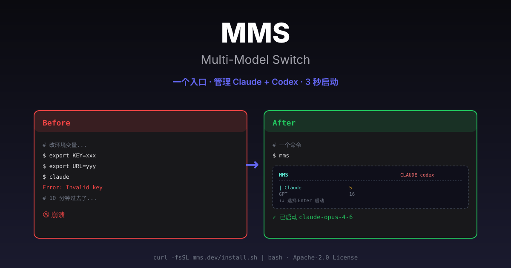
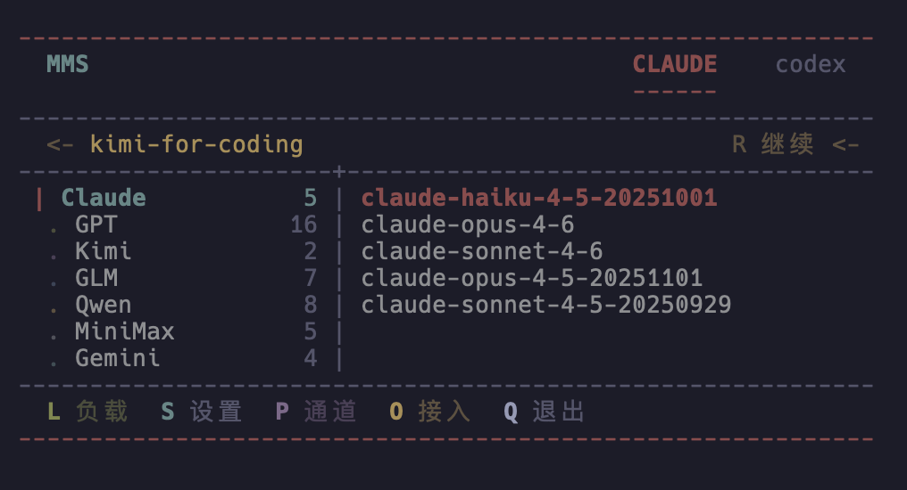
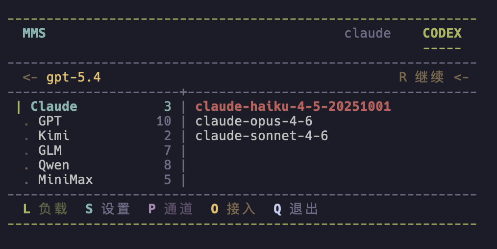
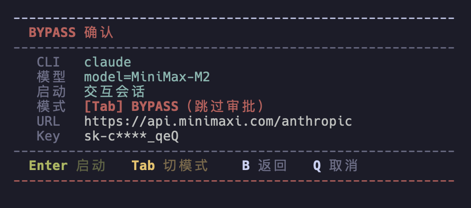

# Multi-Model Switch (MMS)

[English README](./README.md)

[](https://opensource.org/licenses/MIT)

> 一个让 `claude`、`codex` 等 AI 编程 CLI 统一接入的本地 launcher。

## 一键安装

```bash
curl -fsSL https://raw.githubusercontent.com/CtriXin/multi-model-switch/main/install.sh | bash -s --
```



**MMS** 是一个面向本地开发者的多模型 CLI 启动器。它让你用**一个入口**管理所有 AI 编程工具，告别繁琐的环境变量配置。

---

## ✨ 核心特性

- 🎯 **统一 TUI**：方向键选模型，回车启动，无需记忆命令
- ⚡ **快速切换**：一行命令临时切换 provider 或账号
- 🔧 **环境导出**：一键生成 env 文件供脚本使用
- 🩺 **健康诊断**：内置 `doctor` 命令检测所有 provider 状态
- 🔍 **链路追踪**：`--trace` 模式查看选择逻辑
- 🏠 **账号隔离**：多 OAuth 账号独立目录，互不串号
- 📝 **预设系统**：保存常用配置，一键启动

---

## 📦 安装

### 一键安装（推荐）

```bash
curl -fsSL https://raw.githubusercontent.com/CtriXin/multi-model-switch/main/install.sh | bash -s --
```

默认会安装最新发布的 semver tag。
如果在交互终端里执行，安装脚本现在会先询问 `中文 / English`，然后逐项询问是否安装 `RTK enhancement`、`MindKeeper context pack`、`Map auto-index`、`read-once`，最后检查本机有没有 `Claude Code` / `Codex CLI`，只对缺失项逐个询问要不要安装。
安装包会同时带上 MMS 自己的 `statusline-command.sh`，不依赖用户已有的全局 `~/.claude/` 脚本。

### 一键升级

```bash
curl -fsSL https://raw.githubusercontent.com/CtriXin/multi-model-switch/main/install.sh | bash -s --
```

### 安装时改成 English UI

```bash
curl -fsSL https://raw.githubusercontent.com/CtriXin/multi-model-switch/main/install.sh | bash -s -- --lang en
```

### 安装时顺手加上 RTK rewrite 增强

```bash
curl -fsSL https://raw.githubusercontent.com/CtriXin/multi-model-switch/main/install.sh | bash -s -- --install-rtk
```

这条可选路径会额外安装 `jq` + `rtk`，并把 Claude 的 `PreToolUse:Bash` hook 配好；之后通过 MMS 启动的 Claude session 会自动继承 RTK rewrite。若本机已经有 `Codex CLI`，或者本轮安装时顺手装上了 `Codex CLI`，安装器也会继续执行 `rtk init --codex --global`。

### 安装 MMS 时顺手加上 MindKeeper context pack

```bash
curl -fsSL https://raw.githubusercontent.com/CtriXin/multi-model-switch/main/install.sh | bash -s -- --install-mindkeeper-context
```

这条可选路径会安装：

- `MindKeeper MCP`
- Claude 的 `/distill`
- Claude 的 `/cz`
- Claude 的 `UserPromptSubmit` token monitor hook

如果本机没有 `jq`，安装器也会尝试补装，因为 token monitor hook 依赖它。

边界说明：

- 这是 `Claude` 优先的 context 可选包，不包含 Hive compact/restore
- 当前不会顺手给 `Codex` 写独立 slash command
- `Hive` 相关 hook / pack 仍保持独立，不进 MMS 默认安装

### 安装 MMS 时顺手加上 Map auto-index

```bash
curl -fsSL https://raw.githubusercontent.com/CtriXin/multi-model-switch/main/install.sh | bash -s -- --install-map
```

这条可选路径会安装 `Map`，并把 Claude 的 `SessionStart` auto-index hook 配好。之后进入项目时，Claude 会自动建立或刷新项目结构索引。

边界说明：

- 当前优先接入 `Claude` 的 `SessionStart` hook
- 需要本机已有可用的 `Node.js` / `npm`
- 如果 `Map` 构建产物不存在，安装器会跳过 hook 注入并给出提示

### 安装 MMS 时顺手加上 read-once

```bash
curl -fsSL https://raw.githubusercontent.com/CtriXin/multi-model-switch/main/install.sh | bash -s -- --install-read-once
```

这条可选路径会安装 `read-once`，并把 Claude 的下面两类 hook 配好：

- `PreToolUse:Read` token saver hook
- `PostCompact` cache reset hook

效果是避免重复全文读取文件，并在文件变化后优先提供 diff。若本机没有 `jq`，安装器也会尝试补装；如果仍然缺失，hook 会保持 fail-open 静默模式，不阻塞 Claude 正常使用。

### 安装 MMS 时顺手补齐常用 CLI

```bash
curl -fsSL https://raw.githubusercontent.com/CtriXin/multi-model-switch/main/install.sh | bash -s -- --install-cli claude,codex
```

支持的名字只保留：`claude`、`codex`。

### 安装指定版本

```bash
curl -fsSL https://raw.githubusercontent.com/CtriXin/multi-model-switch/main/install.sh | bash -s -- --ref v1.2.0
```

### 手动安装

```bash
git clone https://github.com/CtriXin/multi-model-switch.git
cd multi-model-switch
bash install.sh --write-shell-rc
```

---

## 🚀 快速开始

### 1. 首次配置

```bash
mms config connect    # 进入配置向导，添加第一个 provider
```

### 2. 启动 TUI

```bash
mms                   # 进入交互界面，选择模型启动
```

### 3. 快速启动（免交互）

```bash
mms --preset coding                    # 使用预设启动
mms claude --provider openrouter       # 临时指定 provider
mms codex --account work               # 临时切换账号
```

---

## 📸 界面预览

### Claude Tab


### Codex Tab


### 启动确认页

*启动前确认配置：模型、Provider、模式一目了然*

**操作说明**：
- `←/→`：切换 CLI Tab（claude / codex / qwen / kimi）
- `↑/↓`：选择模型族群 / 模型
- `Enter`：确认启动
- `P`：从 Provider 角度浏览
- `O`：接入新通道
- `Q/Esc`：退出

---

## 🎯 使用场景

### 场景 1：日常开发

每天需要切换不同模型对比效果：

```bash
mms                              # 进入 TUI，方向键选择
# 或者直接用预设
mms --preset sonnet-for-coding   # 启动 Claude Sonnet
mms --preset gpt-for-review      # 启动 GPT 做 Code Review
```

### 场景 2：多账号管理

公司和个人的 AI 账号需要分开：

```bash
# 配置多个账号
mms config account.add claude    # 添加个人号
mms config account.add claude    # 添加工作号

# 启动时切换
mms claude --account personal    # 个人项目
mms claude --account work        # 工作项目
```

### 场景 3：团队协作

团队共享配置，但密钥各自保管：

```bash
# 团队 leader 创建 override.toml
# 包含推荐的 provider 配置（不含密钥）
# 分发给团队成员

# 成员只需要填自己的 API Key
mms config provider.credentials my-provider
```

### 场景 4：CI/CD 集成

为脚本导出环境变量：

```bash
# 生成独立 env 文件
mms env my-preset --apply

# 在脚本中使用
source ~/.config/mms/env/my-preset.sh
claude
```

### 场景 5：问题诊断

Provider 连不上或模型异常：

```bash
# 快速诊断所有 provider
mms doctor --skip-claude-cli

# 测试特定 provider
mms test --provider openrouter --cli claude

# 查看详细选择链路
mms --trace --preset coding
```

---

## 🛠️ 完整命令列表

### 配置管理

```bash
mms config connect                    # 统一接入向导
mms config migrate                    # 从旧版 ccs 迁移
mms config file                       # 查看配置文件路径

mms config provider.list              # 查看 provider 列表
mms config provider.add [template]    # 添加 provider（支持模板）
mms config provider.edit <id>         # 编辑 provider
mms config provider.remove <id>       # 删除 provider
mms config provider.credentials [id]  # 编辑密钥

mms config account.add <cli>          # 添加 OAuth 账号
mms config account.login <id>         # 登录账号
mms config account.status [id]        # 查看登录状态
```

### 模型管理

```bash
mms ls                                # 列出所有模型（支持测速）
mms warm                              # 预热模型
mms cache                             # 查看/调整缓存策略
```

### 诊断工具

```bash
mms doctor                            # 全面诊断
mms doctor --provider <id>            # 诊断指定 provider
mms doctor --skip-claude-cli          # 跳过 CLI 层，只测协议
mms test --provider <id> --cli <name> # 最小闭环测试
```

### Broker 实验入口

```bash
mms broker ls                         # 查看 broker profiles
mms broker show <id>                  # 查看单个 broker profile
mms broker run <id>                   # 从 MMS 启动 broker session shell
mms broker run <id> --resume-last     # 续上当前项目最近一次 broker session
mms broker smoke <id>                 # 跑一条 official child attach smoke test
```

现在也可以直接：

- 运行 `mms`
- 切到 `claude` tab
- 按 `B`

如果配置了多个 broker profile，MMS 会先让你选一个；进入后默认先尝试 `resume-last`，当前项目还没有本地记忆 session 时会自动新建，不会直接报错退出。

现在 broker profile 也会出现在 `claude` 的正常“使用入口”列表里：

- 你可以像选 `官方` / `网关` 一样选它
- 选中后会直接走 `cc-official-broker`
- 如果 profile 的 `entry_mode = "official_proxy"`，MMS 会直接拉起本机真实 official `Claude` CLI，再通过本地 proxy 接到远端 official runtime，不需要再按 `B` 进 broker shell
- 如果你是 `mms claude` 这种直接启动，选中 broker 后会直接进 remote official cc，不再额外弹本地模型列表

当前按 `B` 进去后，如果你不知道该测什么，先记两条命令就够了：

- `/tool pwd`
  - 验证本地 runner / 本地文件现场这条线
- `/official`
  - 验证 broker 是否真的返回 `sdk_url + access_token`，并让真实 official child attach 上来

如果你连 broker shell 都不想看，只想“按 B 后直接像普通通道一样进 cc”，现在可以在对应 `broker_profile` 里加：

```toml
entry_mode = "official_proxy"
```

这样按 `B` 选中这个 profile 后，会直接调用 `cc-official-broker official:proxy`，不再先进 broker shell。

如果你之前已经配成 `entry_mode = "official_connect"`，但本机 public `Claude Code` 不支持 direct-connect，MMS 现在也会自动改走 `official:proxy`，不需要手动回 shell。

`broker_profiles` 现在也可以顺带声明远端 runtime service 目标，例如：

- `remote_service_label`
- `remote_service_base_url`
- `remote_service_endpoint`
- `remote_service_model`
- `remote_service_bearer_token_env`

这样一个 broker profile 就可以对应一个 server-side runtime / OAuth 池，便于后续做多 OAuth 测试，而不影响原有 provider/account 主路径。

当前 broker shell 还会把最近一次本地 session 记到 `~/.config/cc-official-broker/session-registry.json`，作用域按 `device/workspace/project_root` 区分，所以 `--resume-last` 只会续当前项目自己的那条会话，不会去串别的项目。

如果你现在想先验证“这个 broker profile 能不能真的吐出 `sdk_url + access_token` 给 official child”，可以直接：

```bash
mms broker smoke official-broker-personal
```

它会复用 profile 里的 `broker_base_url + device_key`，然后内部调用 `cc-official-broker` 的 `official:attach`：

- 先做 `POST /auth/device`
- 再做 `POST /sessions`
- 再拉起本机真实 official `claude --print --sdk-url ...`

如果结果是：

- `protocol_ok_auth_missing`

就说明：

- MMS 侧 profile 接线是通的
- broker 已经返回了真实可消费的 `sdk_url + access_token`
- 当前机器只是 local Claude CLI 还没登录

### 聊天与讨论

```bash
mms chat "解释递归"                   # 多模型并排对话
mms discuss "设计 proto"              # 多模型摘要 + 综合裁定
mms session resume <id>               # 恢复会话
```

---

## 🏗️ 架构设计

### 核心原则

1. **单次注入**：环境变量只在本次启动生效，不写全局 shell 配置
2. **凭据隔离**：`config.toml` 只存元数据，密钥存 `credentials.sh` 或系统 keychain
3. **本地覆盖**：支持 `~/.config/mms/override.toml`，团队共享不泄露密钥
4. **账号隔离**：每个 OAuth 账号独立目录，登录态互不干扰

### 数据流

```
用户输入 → mms → 解析配置 → 选择 provider/account →
注入环境变量 → 启动目标 CLI → 清理环境
```

### 支持的 CLI

| CLI | 协议 | 特性 |
|-----|------|------|
| `claude` | Anthropic Messages | 支持 bridge 模式挂 GPT/Gemini |
| `codex` | OpenAI Responses | 自动降级到 Chat Completions |
| `qwen` | OpenAI compatible | 直接启动 |
| `kimi` | OpenAI compatible | 默认 kimi-k2.5 |
| `gemini` | Google AI | OAuth 账号支持 |

---

## 📁 配置文件

### 目录结构

```
~/.config/mms/
├── config.toml          # 模型源元数据
├── credentials.sh       # API Key（加密存储）
├── override.toml        # 本地/团队覆盖配置
├── usage.json           # 本地启动统计
├── speed-stats.json     # 模型测速结果
└── accounts/            # OAuth 账号目录
    ├── personal/
    └── work/
```

### config.toml 示例

```toml
[provider]
default = "openrouter"

[[providers]]
id = "openrouter"
name = "OpenRouter"
protocols = ["anthropic_messages", "openai_chat_completions"]
supported_clis = ["claude", "codex"]

[[accounts]]
id = "personal"
cli = "claude"
home_dir = "~/.config/mms/accounts/personal"
```

---

## 🚧 已知限制

- 首次启动需要配置至少一个 provider
- 部分国产模型需通过 gateway bridge 使用
- Windows 原生支持正在开发中（目前可用 WSL）

---

## 🗺️ 路线图

- [ ] **Phase 2**：负载模式（自动按任务复杂度选模型）
- [ ] GUI 配置界面
- [ ] 插件系统
- [ ] Windows 原生支持
- [ ] 云端配置同步

---

## 🤝 贡献

欢迎 Issue 和 PR！

1. Fork 本仓库
2. 创建特性分支 (`git checkout -b feature/amazing`)
3. 提交更改 (`git commit -m 'Add amazing feature'`)
4. 推送分支 (`git push origin feature/amazing`)
5. 创建 Pull Request

---

## 📄 License

MIT © 2026 [CtriXin](https://github.com/CtriXin)

---

## 🙏 致谢

感谢所有测试和反馈的用户。特别感谢以下开源项目：
- [Claude Code](https://github.com/anthropics/claude-code)
- [Codex CLI](https://github.com/openai/codex)
- [Rich](https://github.com/Textualize/rich) - Python TUI 库
